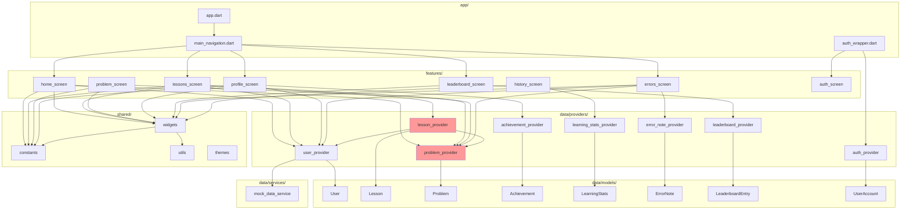
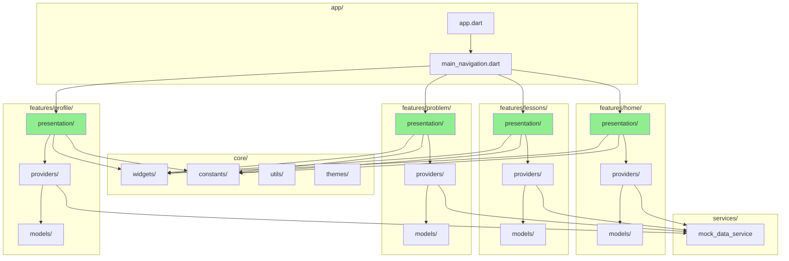
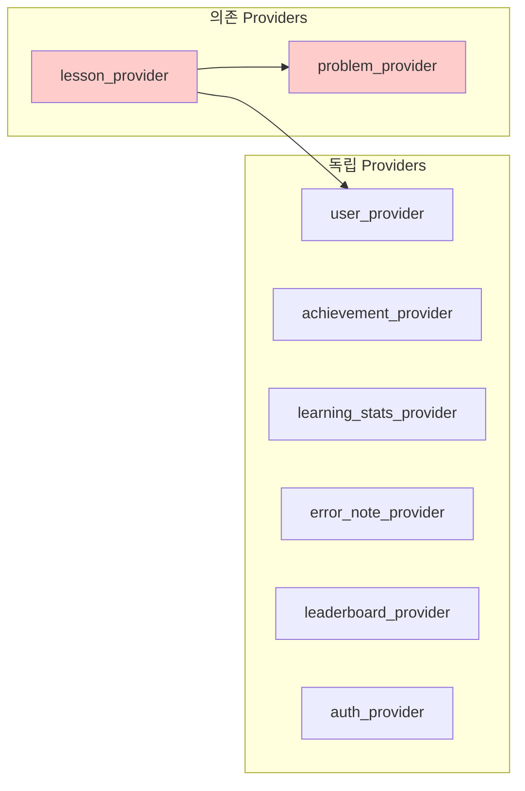
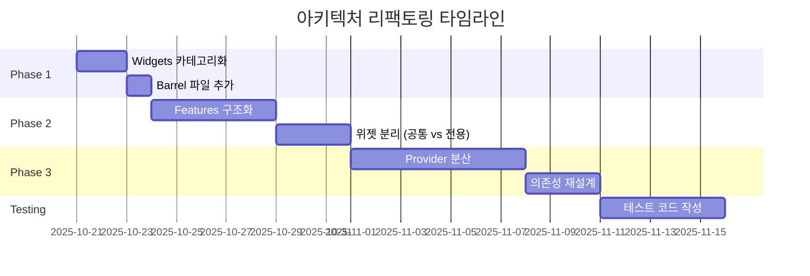

# MathLab 아키텍처 다이어그램

## 현재 의존성 구조



## 문제점 표시

```
🔴 P2 (lesson_provider) → P1, P3 (교차 의존성)
⚠️  shared/widgets (24개 파일 과밀)
⚠️  features (구조화 부족)
```

## 권장 구조 (Feature-First)



## shared/widgets 카테고리화 구조

```
shared/widgets/
├── buttons/                    (3 files)
│   ├── primary_button.dart
│   ├── animated_button.dart
│   └── duolingo_button.dart
│
├── cards/                      (5 files)
│   ├── duolingo_card.dart
│   ├── progress_card.dart
│   ├── special_progress_card.dart
│   ├── stat_card.dart
│   └── achievement_card.dart
│
├── dialogs/                    (3 files)
│   ├── level_up_dialog.dart
│   ├── badge_unlock_dialog.dart
│   └── daily_reward_dialog.dart
│
├── indicators/                 (3 files)
│   ├── duolingo_circular_progress.dart
│   ├── loading_widgets.dart
│   └── xp_animation_widget.dart
│
├── animations/                 (3 files)
│   ├── fade_in_widget.dart
│   ├── xp_animation.dart
│   └── xp_gain_animation.dart
│
├── layout/                     (4 files)
│   ├── responsive_wrapper.dart
│   ├── custom_bottom_nav.dart
│   ├── empty_state.dart
│   └── grade_tab_bar.dart
│
├── inputs/                     (1 file)
│   └── short_answer_input.dart
│
└── feature_specific/          (2 files)
    ├── lesson_card.dart
    └── league_widget.dart

Total: 24 files → 7 categories
```

## Provider 간 의존성 그래프



**해결 방안:**
1. lesson_provider에서 user와 problem 로직 분리
2. 이벤트 기반 통신으로 전환 (Riverpod Ref.listen)
3. 공통 비즈니스 로직은 별도 Service로 추출

## 복잡도 히트맵

```
📁 lib/
├── 📊 shared/widgets/        🔴 복잡도: 0.85 (24 files) ← 우선 개선 대상
├── 📊 data/models/           🟡 복잡도: 0.60 (12 files)
├── 📊 data/providers/        🟢 복잡도: 0.40 (8 files)
├── 📊 features/problem/      🟢 복잡도: 0.20 (4 files)
├── 📊 shared/constants/      🟢 복잡도: 0.20 (4 files)
└── 📊 shared/utils/          🟢 복잡도: 0.20 (4 files)

범례:
🔴 0.7-1.0: 즉시 개선 필요
🟡 0.5-0.7: 주의 필요
🟢 0.0-0.5: 양호
```

## 리팩토링 로드맵



## 개선 효과 예측

```
현재 상태 → Phase 1 → Phase 2 → Phase 3

파일 검색 시간:
  30초 → 20초 → 15초 → 10초

Import 길이:
  ~60자 → ~50자 → ~45자 → ~35자

코드 리뷰 시간:
  60분 → 50분 → 40분 → 30분

전체 건강도:
  72/100 → 78/100 → 85/100 → 92/100
```

---

**참고:**
- 이 다이어그램은 Mermaid를 사용하여 작성되었습니다
- GitHub, Notion, VS Code 등에서 렌더링 가능
- 온라인 뷰어: https://mermaid.live/
